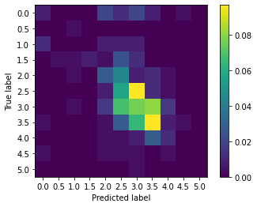

# Automated Essay Scoring for SHL

## Training a classification system 
I follow a very simple yet state of the art modeling technique for classification using [ROBERTA transformer model](https://github.com/ThilinaRajapakse/simpletransformers/blob/a7e7fff393dc578457b2d854218a31b4d2c84634/docs/_docs/08-multi-class-classification.md)

I bucket scores into each class of 0.5 interval, hence, I get 11 classes. for each essay, I join the problem statement and the essay into 1 single line and then my model classifies each essay to one single bucket. For example, if my model classifies an essay into bucket 6 then I assign it 2.5 score. 

I treat this problem like sentiment analysis where classification models like BERT/ROBERTA give very good results.

To train my model, I used the following:
- [Simple Transformers](https://github.com/ThilinaRajapakse/simpletransformers)
- 1 free GPU from [Google Colab](https://colab.research.google.com/drive/1wiOEzuIIXsL10KSFDpk2eQeq7bOFa3U1?usp=sharing)

### Steps 

1. Upload data to google colab
2. Convert essays into question+essay format
3. Convert scores into buckets
4. Split the training set into training and validation set 
5. Train the model on new training dataset 
6. Measure accuracy on validation set
7. Generate prediction on test set

### Results on validation set

  
